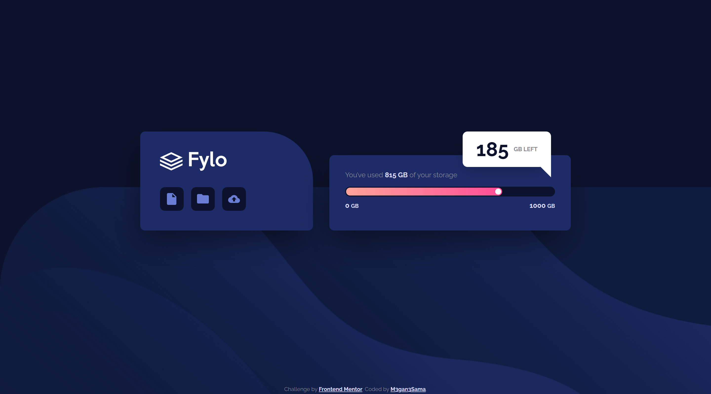
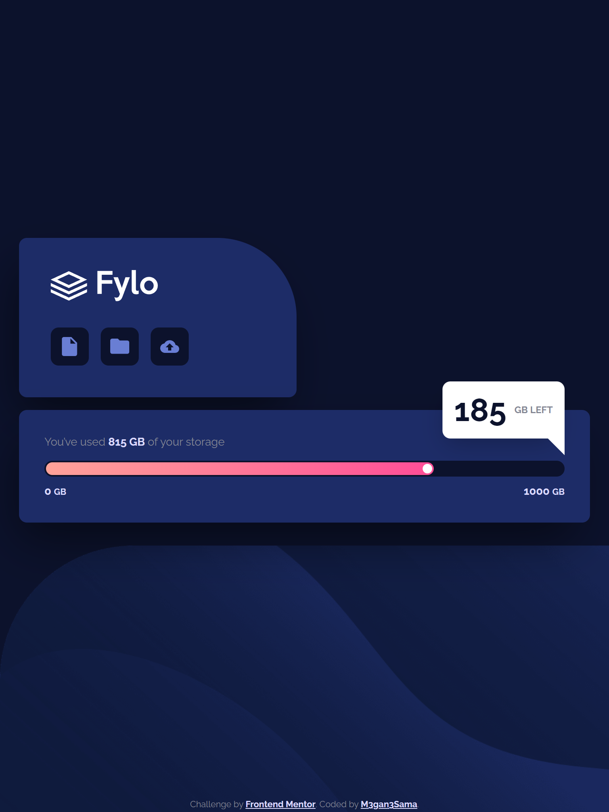
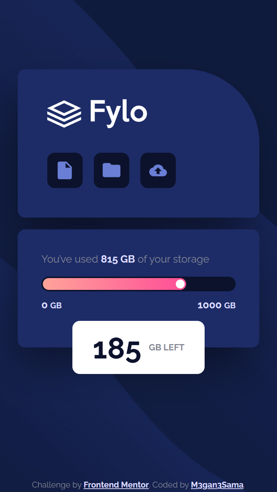

# Frontend Mentor - Fylo data storage component

This is a solution to the [Fylo data storage component challenge on Frontend Mentor](https://www.frontendmentor.io/challenges/fylo-data-storage-component-1dZPRbV5n).

## Welcome! 👋

Thanks for checking out this front-end coding challenge.

## Overview

### The challenge

This challenge is to making a data storage layout and make it responsive.

### Screenshot

#### Desktop preview:

  

---

#### Tablet preview:

  

---

#### Mobile preview:

  

---

### Links

- Solution URL: [You can find My solution here](https://github.com/M3gan3Sama/social-proof-section-master.git)
- Live Site URL: [This is my Live site for This challenge](https://m3gan3sama.github.io/social-proof-section-master/)
